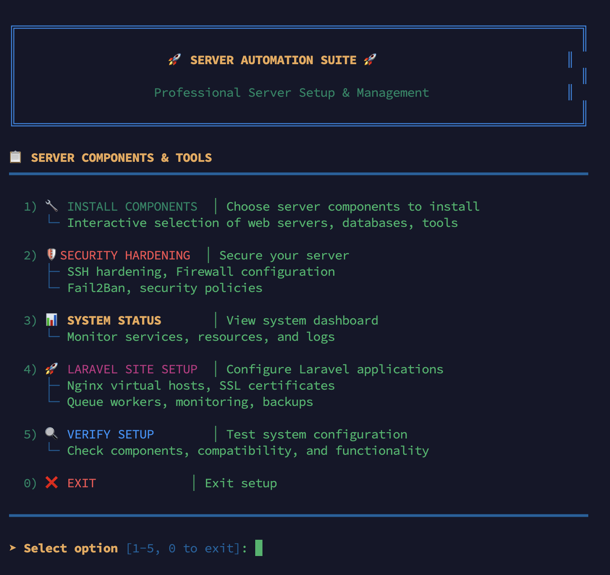
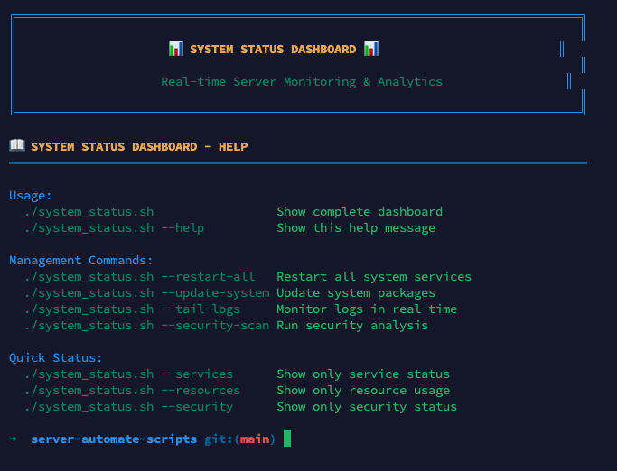

# 🛠️ Server Automation Scripts

> **A clean, professional server automation suite for Laravel/PHP development environments**

A DRY-compliant collection of bash scripts for automating Ubuntu server setup with Laravel/PHP applications. Features real-time installation output, comprehensive error handling, and an intuitive menu-driven interface.

## ✨ Key Features

🔧 **Interactive Installation** - Choose exactly what you need  
🛡️ **Security Hardening** - Production-ready security configurations  
📊 **Real-time Monitoring** - Beautiful system status dashboard  
🚀 **Laravel Integration** - Automated site setup with SSL and queues  
🐳 **Docker Support** - Container platform with user permissions  
💅 **Enhanced Shell** - Oh My Zsh with Laravel-specific aliases  
🔍 **System Verification** - Test and validate your configuration  

## 📋 Table of Contents

- [📸 Screenshots](#-screenshots)
- [🎯 Design Principles](#-design-principles)
- [🚀 Quick Start](#-quick-start)
- [📁 Project Structure](#-project-structure)
- [🔧 Shared Library Functions](#-shared-library-functions)
- [📦 Available Components](#-available-components)
- [🛡️ Security Features](#️-security-features)
- [📊 Monitoring & Management](#-monitoring--management)
- [🛠️ Development & Customization](#️-development--customization)
- [⚙️ Configuration](#️-configuration)
- [🎮 Management Commands](#-management-commands)
- [🆘 Troubleshooting](#-troubleshooting)
- [🎯 Requirements](#-requirements)

## 📸 Screenshots

### Main Menu Interface

*Clean, intuitive menu interface with organized options for server management*

### System Status Dashboard  

*Real-time monitoring dashboard with service status, resource usage, and system information*

## 🎯 Design Principles

- **DRY (Don't Repeat Yourself)** - Shared library eliminates code duplication
- **Modular** - Each component is independent and reusable
- **Consistent** - Standardized logging, error handling, and user interaction
- **Simple** - Clean, readable scripts with minimal complexity
- **Transparent** - Real-time output during installation for full visibility

## 🔧 Recent Improvements

## 📁 Project Structure

```
server-automate-scripts/
├── 📁 lib/
│   └── common.sh           # 🧰 Shared library with all common functions
├── 📁 features/            # 🔧 Individual component installers
│   ├── install_template.sh # 📋 Template for new components
│   ├── install_nginx.sh    # 🌐 Web server
│   ├── install_php.sh      # 🐘 PHP with multiple versions
│   ├── install_mysql.sh    # 🐬 MySQL database
│   ├── install_redis.sh    # 🔴 Redis cache
│   ├── install_docker.sh   # 🐳 Docker containers
│   └── setup_security.sh   # 🛡️ Security hardening
├── 📁 screenshots/         # 📸 Interface screenshots
├── server_setup.sh         # 🎮 Main installation script
├── laravel_site_enable.sh  # 🚀 Laravel site configuration
├── system_status.sh        # 📊 System monitoring dashboard
└── verify_setup.sh         # 🔍 Setup verification tool
```

## 🚀 Quick Start

### 1. 🔍 Verify Your Setup
```bash
./verify_setup.sh
```
*Verify that all components are working correctly and show you available features.*

### 2. 🛠️ Server Setup
```bash
sudo ./server_setup.sh
```

**🎮 Interactive Experience:**
- ✅ Real-time output during installation
- ✅ Individual component selection with clear feedback  
- ✅ Detailed error reporting and recovery options
- ✅ Progress indicators and status updates
- ✅ Integrated Laravel site setup and verification tools

**📋 Main Menu Options:**
1. **🔧 Install Components** - Interactive component selection (web servers, databases, PHP tools)
2. **🛡️ Security Hardening** - Server security configuration  
3. **📊 System Status** - Real-time monitoring dashboard
4. **🚀 Laravel Site Setup** - Configure Laravel applications with SSL, queues, and monitoring
5. **🔍 Verify Setup** - Test system configuration and compatibility
6. **🐳 Docker Platform** - Install Docker & Docker Compose with user permissions
7. **💅 Oh My Zsh** - Enhanced shell experience with Laravel-specific aliases

### 3. 🎯 Direct Script Access
You can also run scripts directly if needed:
```bash
# Laravel site configuration
sudo ./laravel_site_enable.sh

# System verification
./verify_setup.sh

# System monitoring
./system_status.sh
```

## 🔧 Shared Library Functions

All scripts use `lib/common.sh` which provides:

### 📝 Logging Functions
```bash
log_info "Information message"    # ℹ️ Blue info messages
log_success "Success message"     # ✅ Green success messages  
log_warning "Warning message"     # ⚠️ Yellow warning messages
log_error "Error message"         # ❌ Red error messages
log_step "Process step"           # 🔄 Purple step indicators
```

### ⚙️ System Management
```bash
update_system                     # 📦 Update packages
install_packages pkg1 pkg2        # 📥 Install packages
enable_service service_name       # ▶️ Enable & start service
restart_service service_name      # 🔄 Restart service
check_service service_name        # 🔍 Check if running
```

### 🚀 Enhanced Installation Features
```bash
install_component "component"     # 📦 Install with real-time output and error handling
setup_logging "script-name"      # 📝 Setup logging with terminal output
```

### 👤 User Interaction
```bash
prompt_with_default "Prompt" "default" "VAR_NAME"  # 💬 Interactive prompts
prompt_yes_no "Question?" "default"                # ❓ Yes/No questions
```

### 📂 File Operations
```bash
backup_file "/path/to/file"                        # 💾 Create backups
create_directory "/path" "owner:group" "permissions" # 📁 Safe directory creation
configure_file "/path" "search" "replace"          # ⚙️ Configuration updates
```

### 🛠️ Configuration Generation
```bash
generate_nginx_config "domain" "/path" "php_version"  # 🌐 Nginx virtual hosts
generate_supervisor_config "domain" "/path"           # 👷 Queue worker configs
```

## 📦 Available Components

### 🔧 Core Installation Components
*Interactive batch installation via main menu option 1*

| Component | Description | Features |
|-----------|-------------|----------|
| 🌐 **Nginx** | High-performance web server | Reverse proxy, SSL ready, optimized configs |
| 🐘 **PHP** | Multiple versions (7.4-8.3) | Version switcher, FPM pools, extensions |
| 🐬 **MySQL** | Relational database | User management, secure installation |
| 🐘 **PostgreSQL** | Advanced database | JSON support, user management |
| 🔴 **Redis** | In-memory cache | Session storage, Laravel cache |
| 🟢 **Node.js** | JavaScript runtime | Latest LTS, npm included |
| 📦 **Composer** | PHP dependency manager | Global installation, Laravel optimized |
| 👷 **Supervisor** | Process supervisor | Queue workers, auto-restart |
| 🛡️ **Fail2Ban** | Intrusion prevention | SSH protection, custom rules |
| 🔒 **Certbot** | SSL certificates | Let's Encrypt, auto-renewal |
| 🗂️ **Logrotate** | Log management | Laravel logs, retention policies |

### 🎯 Dedicated Menu Options
*Individual installations with focused configuration*

| Option | Component | Features |
|--------|-----------|----------|
| **6** | 🐳 **Docker Platform** | Container runtime, Docker Compose, user permissions |
| **7** | 💅 **Oh My Zsh** | Enhanced shell, Laravel aliases, productivity tools |
| **2** | 🛡️ **Security Hardening** | SSH hardening, firewall, fail2ban, updates |

## 🛡️ Security Features

- 🔥 **UFW Firewall** - Sensible defaults with custom rules
- 👮 **Fail2Ban** - Intrusion prevention and IP blocking  
- 🔐 **SSH Hardening** - Key-based auth, port changes, root restrictions
- 🔄 **Automatic Updates** - Security patches and system updates
- 📊 **Security Monitoring** - Log analysis and threat detection
- 🔒 **SSL/TLS Encryption** - Let's Encrypt certificates with auto-renewal

## 📊 Monitoring & Management

- 📈 **Real-time Dashboard** - System resources and service status
- 🚨 **Health Monitoring** - Service availability and performance
- 💾 **Automated Backups** - Daily database and file backups
- 🗂️ **Log Management** - Rotation, retention, and monitoring
- 📧 **Alert System** - Email notifications for critical events
- 🔧 **Remote Management** - SSH access and system tools

## 🛠️ Development & Customization

### 🔧 Creating New Components

Use the provided template for consistency:
```bash
cp features/install_template.sh features/install_newfeature.sh
# Edit the new script following the template pattern
```

**📋 All feature scripts should:**
1. ✅ Load the common library
2. ✅ Use `init_common()`
3. ✅ Use standard logging functions
4. ✅ Follow the template structure
5. ✅ Provide real-time feedback to users

### 🧪 Testing Your Changes

Verify your setup works correctly:
```bash
./verify_setup.sh
```

### 📚 Common Library Functions

The shared library provides all common functionality to eliminate duplication:
- ✅ Consistent error handling with proper exit codes
- ✅ Standardized logging with real-time terminal output
- ✅ Unified configuration management
- ✅ Reusable utility functions
- ✅ Enhanced user interaction

## ⚙️ Configuration

All defaults are defined in `lib/common.sh`:
```bash
readonly DEFAULT_PHP_VERSION="8.3"      # 🐘 Default PHP version
readonly DEFAULT_SSH_PORT=22            # 🔑 SSH port configuration
readonly DEFAULT_MEMORY_LIMIT="512M"    # 💾 PHP memory limit
readonly LOG_RETENTION_DAYS=30          # 📝 Log retention policy
```

## 🎮 Management Commands

```bash
# 🔍 Setup verification
./verify_setup.sh                # Verify all components

# 📊 System status and management
./system_status.sh               # Full dashboard
./system_status.sh --restart-all # Restart services
./system_status.sh --update-system # Update packages
./system_status.sh --tail-logs   # Monitor logs

# 🐘 PHP version management (after PHP installation)
php-switch 8.3                  # Switch PHP version
```

## 🆘 Troubleshooting

### 🔧 Installation Issues
1. **❌ No output during installation**: This has been fixed! You should now see real-time output.
2. **📋 Component installation fails**: Check the log file location shown during installation.
3. **🔐 Permission issues**: Ensure you're running with `sudo` for system installations.
4. **🔍 Setup verification fails**: Run `./verify_setup.sh` to diagnose issues.

### 📝 Viewing Logs
```bash
# View the latest installation log
tail -f /var/log/server-setup-*.log

# View system status logs
./system_status.sh --tail-logs

# View setup verification logs
tail -f /var/log/verify-setup-*.log
```

### 🆘 Common Solutions
- **🐘 PHP not working**: Check if the correct version is selected with `php-switch`
- **🌐 Nginx errors**: Verify configuration with `nginx -t`
- **🔒 SSL issues**: Check certificate status with `certbot certificates`
- **🐳 Docker permissions**: Log out and back in after installation

## 🎯 Requirements

- **OS**: Ubuntu 18.04+ or similar Debian-based Linux distribution
- **Access**: Root/sudo privileges for system installations
- **Network**: Internet connection for package downloads
- **Resources**: Minimum 1GB RAM, 10GB storage

## 📄 License

This project follows DRY principles and is designed for maintainability and reusability.

---

<div align="center">

**🚀 Server Automation Suite v1.0.0 - Production Ready!**

*Clean, Simple, DRY* ✨

[](https://github.com)
[](https://www.gnu.org/software/bash/)
[](https://laravel.com)
[](https://docker.com)

</div> 